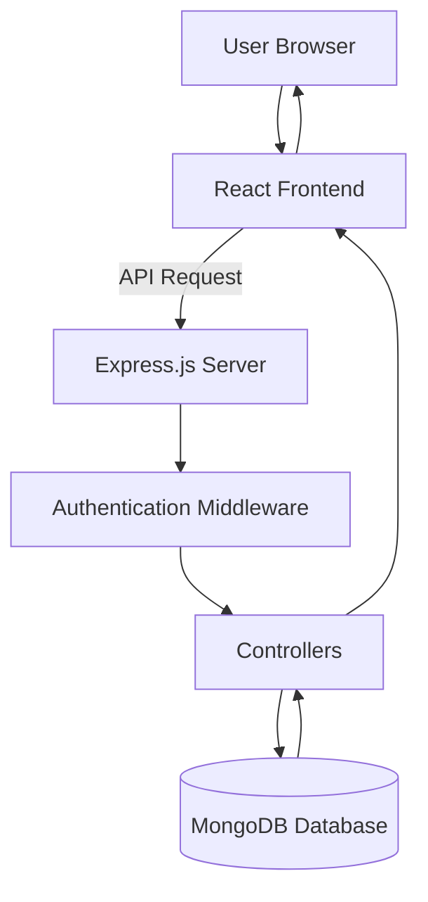

# 💼 CareerHive – Job Portal Web Application


A **full-stack Job Portal web application** built using the **MERN Stack (MongoDB, Express.js, React.js, Node.js)**.
This platform enables **recruiters to post job openings** and **candidates to browse and apply for jobs** easily.

The project demonstrates **REST API development, authentication, role-based authorization, and full-stack integration.**

---

# 🌐 Live Demo

🔗 https://careerhive-portal.vercel.app/

---

# 🚀 Features

## 👩‍💼 Recruiter

* Secure Registration & Login
* Post new job listings
* Edit/Delete job postings
* View job applicants

## 👨‍💻 Candidate

* Register & Login
* Browse job listings
* Apply for jobs
* Track applied jobs

---

# 🛠️ Tech Stack

## Frontend

* React.js
* Tailwind CSS
* Axios
* React Router DOM

## Backend

* Node.js
* Express.js
* MongoDB
* Mongoose
* JWT Authentication
* bcrypt.js

---

> Create a folder named **screenshots** in your repo and add images there.

Example:

```id="sc1"}
screenshots/
home.png
jobs.png
apply.png
dashboard.png
```

---

# 🧠 API Endpoints

## Authentication

### Register User

POST `/api/auth/register`

```json id="api1"}
{
"name": "John Doe",
"email": "john@example.com",
"password": "123456",
"role": "candidate"
}
```

### Login User

POST `/api/auth/login`

---

## Jobs

### Get All Jobs

GET `/api/jobs`

### Post Job (Recruiter Only)

POST `/api/jobs`

### Update Job

PUT `/api/jobs/:id`

### Delete Job

DELETE `/api/jobs/:id`

---

## Applications

### Apply for Job

POST `/api/applications/:jobId`

### Get Applied Jobs

GET `/api/applications/user`

### Get Applicants (Recruiter)

GET `/api/applications/job/:jobId`

---

# ⚡ Architecture Diagram



This architecture shows how:

* The **React frontend** communicates with the **Node.js/Express backend**
* Backend APIs handle **authentication, jobs, and applications**
* Data is stored in **MongoDB**

---

# 📂 Project Structure

```id="struct1"}
job-portal/
│
├── client/              # React Frontend
│   ├── components/
│   ├── pages/
│   ├── services/
│   └── App.jsx
│
├── server/              # Node.js Backend
│   ├── models/
│   ├── routes/
│   ├── controllers/
│   ├── middleware/
│   └── server.js
│
├── screenshots/
├── .env
└── README.md
```

---

# ⚙️ Installation & Setup

## 1️⃣ Clone the Repository

```bash id="clone1"}
git clone https://github.com/rosymohanty/Job-Portal.git
cd Job-Portal
```

---

## 2️⃣ Backend Setup

```bash id="backend1"}
cd server
npm install
```

Create `.env` file inside **server** folder:

```id="env1"}
PORT=5000
MONGO_URI=your_mongodb_connection_string
JWT_SECRET=your_secret_key
```

Run backend:

```bash id="backend2"}
npm start
```

---

## 3️⃣ Frontend Setup

```bash id="frontend1"}
cd client
npm install
npm run dev
```

---

# 🌍 Deployment

| Service  | Platform      |
| -------- | ------------- |
| Frontend | Vercel        |
| Backend  | Render        |
| Database | MongoDB Atlas |

---

# 📈 Future Improvements

* Email notifications
* Admin dashboard
* Advanced job filtering
* Pagination

---

# 👩‍💻 Author

**Rojalin Mohanty**
MCA Student | MERN Stack Developer

GitHub:
https://github.com/rosymohanty

---

# ⭐ Support

If you like this project, please **give it a star ⭐ on GitHub**.
